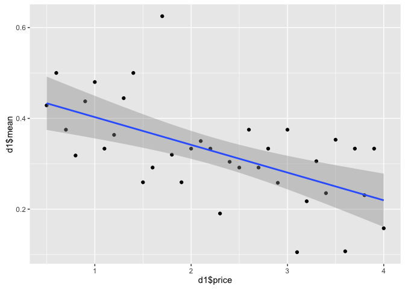
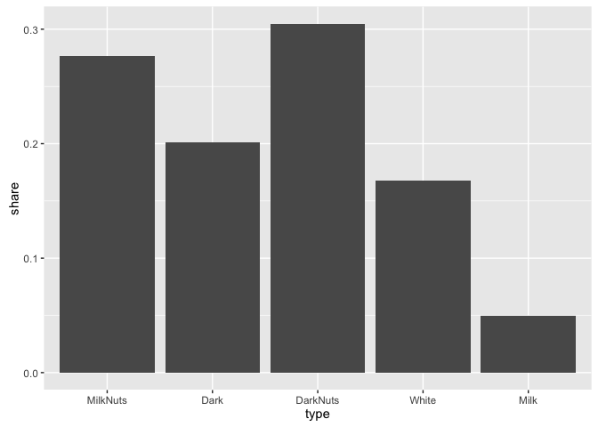
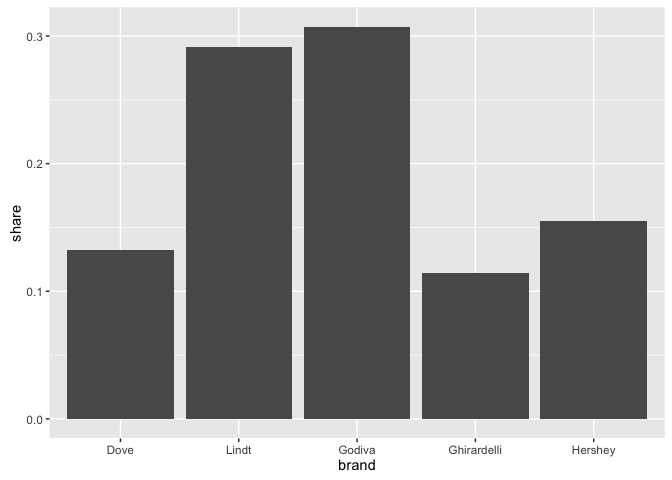
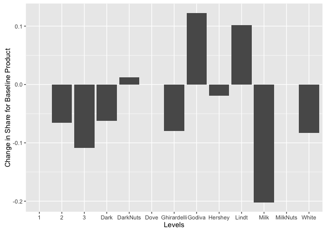
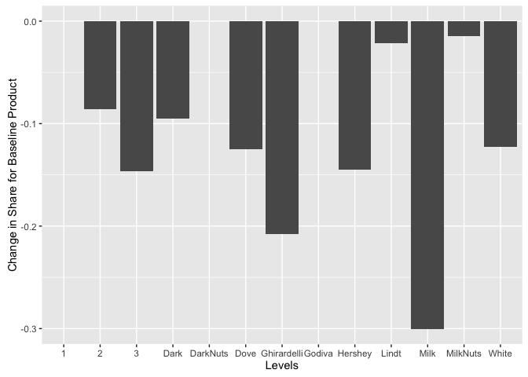
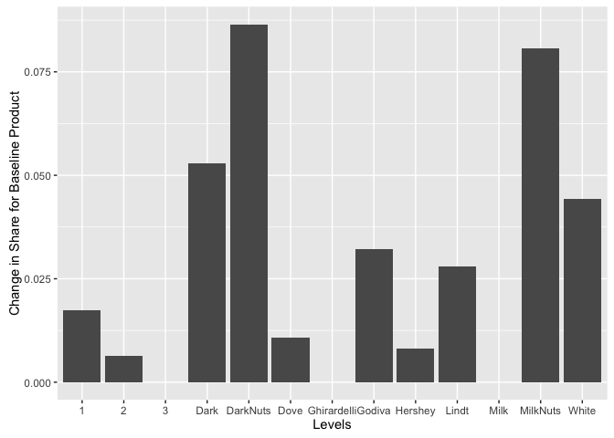

### Contents
 * [Summary](https://github.com/pawelmb57/Conjoint_Eyetracking_Analysis/blob/master/README.md)
 * [Exploring the data](https://github.com/pawelmb57/Conjoint_Eyetracking_Analysis/blob/master/chocolate_eyetracking_exploring.md)
 * [Multinomial Logistic Model](https://github.com/pawelmb57/Conjoint_Eyetracking_Analysis/blob/master/Chocolate_Eye_Tracking_Analysis.md)


# Chocolate Eye Tracking Analysis

Data collected as part of "Decisions about chocolate are
processed differently than decisions on gambles: Evidence from eye-tracking" by Betty E. Kim-Viechnicki.

* Kim-Viechnicki, B.E., Burla, Y., Feit, E., Plassmann, H.,& Kable, J.W. (2013, September). Decisions about chocolate are
processed differently than decisions on gambles: Evidence from eye-tracking. Poster session at the annual meeting of the
Society of Neuroeconomics, Lausanne, Switzerland.


# Eye Tracking Conjoint Analysis


While exploring the data set, we produced descriptive statistics and made graphics to visualize what the data was telling us.  In this section, we try to determine what the most important attributes are that influence a consumers purchasing decision. To do this, we use multinomial logistic regression (R's mlogit function).  

#### Why multinomial logistic regression?
Before getting into the analysis, it is necessary to differentiate between a multinomial analysis and a logistic regression.  In a logistic regression, we might ask the question, what factors influence whether a political candidate will win an election.  The response variable would be binary (1=wins 0=loses) and the independent variables could be hair color, hand size, and money raised.  In this case, a survey question would show one candidate at a time and the given attributes.

But, if we were to give a survey and each question included two candidates and the respective attributes and asked the participant to chose their favorite, this would warrent a multinomial logistic regression.  This survey has two discrete, mutually exclusive choices.  Each trial gives the participant two choices, thus creating a relationship between the choices.  This relationship could not be measure in a logistic regression.


### Analysis Contents
  * Prepare the data
  * Price linearity assumption
  * Alternative pricing variable
  * Number-of-levels Effect
  * MLOGIT!
  * Importance of mlogit intercept
  * Choice shares
  * Attribute Sensitivity
  

### Prep

```r
library(mlogit)
library(plotly)

data <- as.data.frame(read.csv("http://goo.gl/GC1gRs"))

data$brand <- as.factor(ifelse(data$B_Dove==1,"Dove",
                     ifelse(data$B_Lindt==1,"Lindt",
                            ifelse(data$B_Godiva==1,"Godiva",
                                   ifelse(data$B_Ghirardelli==1,"Ghirardelli","Hershey")))))
data$type <- as.factor(ifelse(data$T_MilkNuts==1,"MilkNuts",
                    ifelse(data$T_Dark==1,"Dark",
                           ifelse(data$T_DarkNuts==1,"DarkNuts",
                                  ifelse(data$T_White==1,"White","Milk")))))
```


### Checking Assumptions

The basic assumptions of a conjoint analysis are:

  * That the choices presented are made up of a collection of attributes.
    + This is trivial to confirm as each choice has a brand, type, and price.
  * The utility of the product is a function of the attributes.
    + Although perhaps not exhaustive, it is safe to assume that the attributes used meet this assumption
  * The utility of the product predicts behaviour
    + As with the second assumption, it is safe to assume that the brand, type, and price can predict consumer behaviour.
  

### Price linearity assumption
Another assumption of the multinomial logistic regression is that there is a linear relationship between the predictor and the proportion.  This assumption goes back to the idea that the utility of the product is a function of the attributes.  If we were to extrapolate this idea to the extremes, where, for instance, the prices for this experiment ranged from $0.50 to $100, we would have to assume that the purchase response would not be linear. This experiment could conclude that a $50 Hershey bar may not be such a bad idea.  Certainly, consumer response would dictate otherwise.  We would expect that after about $10.00 (considering only personal chocolates and not boxes of specialty chocolate) demand would sharply drop thus creating a nonlinear relationship between the price of the chocolate and the number chosen.

Here, we try to determine whether Price has a linear relationship with the response variable.  The reason I determined it was important to investigate whether price is linear, is because of this histogram.


There is a clear negative relationship between price and the number chosen.  However, it looks like the graph is significantly more dense between 0.5 and 2 than it is where price is greater than 2.  


Using Chosen as the response variable would give us a count of the number of times the chocolate was chosen.  This may not be useful as the number of occurances are not necessarily equal.  Instead, Chosen is transformed into a rate.

```r
d1 <- aggregate(data$Chosen , by=list(data$Price) , FUN=mean )
colnames(d1) <- c("price","mean")

ggplot(d1 , aes(x=d1$price,y=d1$mean)) +
          geom_point() +
          geom_smooth(method=lm)
```

 

The above step created a new table d1 that has the prices and average number of times the price was chosen in a trial.  The graphic shows a scatter plot of the variables as well as a linear regression.  From this, we are not able to conclude that price in nonlinear.  

Another way to visualize whether price is linear is to plot the residuals of the linear regression.  This will take the distance between the actual value and the predicted value and plot it for all prices.


```r
# Run a linear regression
lm1.lm <- lm(mean~price , data=d1)

# Calculate the residuals
lm1.res <- residuals(lm1.lm)


x <- as.data.frame(matrix(rep(NA,72),nrow=36,ncol=2))
colnames(x) <- c("price","residuals")
x$price <- d1$price ; x$residuals <- residuals(lm1.lm)

ggplot(x , aes(x=price,y=residuals)) +
  geom_point() +
  # geom_hline(yintercept=0)
  geom_smooth(method=lm)
```

 

This graph leads me to believe that price is linear. As an aside, A1 in the appendix demonstrates the residual plot for data that is nonlinear.


Another way we can test whether price is linear, is to include the squared term in the model along with the original and if the squared term is significant, then we would have reason to believe that price is nonlinear.


Here, we run mlogit with price squared.

```r
data.testLinear <- data
data.testLinear$priceSquared <- data.testLinear$Price^2
data.testLinear <- mlogit.data( data=data.testLinear
                            ,choice="Chosen"
                            ,shape="long"
                            ,varying=c("Price","brand","type","Brand_Fix","Type_Fix","Price_Fix","fprice","priceSquared")
                            ,alt.levels=paste("pos",1:3)
                            ,id.var="Ind")
m.testLinear <- mlogit(Chosen ~ 0 + Price + priceSquared , data=data.testLinear)
summary(m.testLinear)
```

```
## 
## Call:
## mlogit(formula = Chosen ~ 0 + Price + priceSquared, data = data.testLinear, 
##     method = "nr", print.level = 0)
## 
## Frequencies of alternatives:
## pos 1 pos 2 pos 3 
## 0.374 0.326 0.300 
## 
## nr method
## 3 iterations, 0h:0m:0s 
## g'(-H)^-1g = 6.89E-07 
## gradient close to zero 
## 
## Coefficients :
##              Estimate Std. Error t-value Pr(>|t|)
## Price         -0.4234     0.3236   -1.31     0.19
## priceSquared   0.0352     0.0716    0.49     0.62
## 
## Log-Likelihood: -376
```

This shows us that price squared is not significant, thus, we can conclude with a high degree of confidence that price does not have a nonlinear relationship with the response variable.


#### Setting Price Bins

Another approach to analyzing price is to transform it into a categorical variable with price bins.  The first way that comes to mind would be to divide the range by 3 (or how many bins are necessary) and to have each bin differentiated by that increment.  However, given the nature of the surveys it might lead to uninterpreble results.  For example, one trial might have prices as 0.5,0.6,2 whereas a different trial might have 2,2.5,4.  These two scenarios dramatize when $2 is either on the higher end or lower end of the available choices.  If $2 is chosen it would not always hold true that the $2 chocolate was chosen because of favorable pricing, but rather because it was the cheapest option.  The first experiment would conclude that given those choices, $2 is far too expensive. Although this would takeaway our ability to be able to understand discrete prices, it might give us insight into how a consumer makes the decision with available options.


Considering this impact on choices, price was transformed into a rank of the available choices.  The cheapest option would be ranked 1, the middle option 2, and most expensive option as 3.


```r
data$fprice <- as.factor(ave(data$Price , data$Trial , data$Ind , FUN = function(x) rank(x, ties.method = "first")))
```

We can now test whether having price as categorical bins improves our model.

```r
m.fpr <- mlogit(Chosen ~ 0 + fprice + brand + type , data=data.mlogit)
m.atr <- mlogit(Chosen ~ 0 + Price + brand + type , data=data.mlogit)
summary(m.fpr)
```

```
## 
## Call:
## mlogit(formula = Chosen ~ 0 + fprice + brand + type, data = data.mlogit, 
##     method = "nr", print.level = 0)
## 
## Frequencies of alternatives:
## pos 1 pos 2 pos 3 
## 0.374 0.326 0.300 
## 
## nr method
## 5 iterations, 0h:0m:0s 
## g'(-H)^-1g = 7.05E-06 
## successive function values within tolerance limits 
## 
## Coefficients :
##                  Estimate Std. Error t-value Pr(>|t|)    
## fprice2           -0.3773     0.1400   -2.69   0.0070 ** 
## fprice3           -0.6811     0.1472   -4.63  3.7e-06 ***
## brandGhirardelli   0.4775     0.2214    2.16   0.0310 *  
## brandGodiva        0.5684     0.2065    2.75   0.0059 ** 
## brandHershey      -0.4707     0.2349   -2.00   0.0451 *  
## brandLindt        -0.1017     0.2268   -0.45   0.6539    
## typeDarkNuts      -0.3587     0.2091   -1.72   0.0863 .  
## typeMilk           0.0623     0.2154    0.29   0.7726    
## typeMilkNuts      -0.4955     0.2202   -2.25   0.0244 *  
## typeWhite         -1.7642     0.2642   -6.68  2.4e-11 ***
## ---
## Signif. codes:  0 '***' 0.001 '**' 0.01 '*' 0.05 '.' 0.1 ' ' 1
## 
## Log-Likelihood: -326
```

The summary shows us that there is a significant relationship between the lowest available price and the highest available price where the highest priced option will typically be selected less often.  

We test the two models to determine if price bins better describe the data.

```r
lrtest(m.fpr,m.atr)
```

```
## Likelihood ratio test
## 
## Model 1: Chosen ~ 0 + fprice + brand + type
## Model 2: Chosen ~ 0 + Price + brand + type
##   #Df LogLik Df Chisq Pr(>Chisq)  
## 1  10   -326                      
## 2   9   -327 -1  3.13      0.077 .
## ---
## Signif. codes:  0 '***' 0.001 '**' 0.01 '*' 0.05 '.' 0.1 ' ' 1
```
The lrtest indicate that both models represent the model equally well.  


### Number-of-levels Effect

When deciding on the number of levels a conjoint analysis should have, it is important to cover the range of possibilities.  However, if we include many levels and reducing the number of occurances of each level, the "number-of-levels" effect may occur.  The number of levels effect states that "all else equal, attributes defined on more attributes tend to get more importance."  In other words, given a defined sample size, by having a large number of levels and minimizing the number of times a given level is tested, the model may not perform optimally.

In this case, an alternative design that would reduce the number of levels would include prices 0.5 to 4 by intervals of 0.5.  


### MLOGIT()


The first step is to use mlogit.data() to get the data into either long or wide formal to be used in mlogit().  


```r
library(mlogit)

data.mlogit <- mlogit.data( data=data
                            ,choice="Chosen"
                            ,shape="long"
                            ,varying=c("Price","brand","type","Brand_Fix","Type_Fix","Price_Fix,fprice")
                            ,alt.levels=paste("pos",1:3)
                            ,id.var="Ind")
```


```r
m.atr.int <- mlogit(Chosen ~ Price + brand + type , data=data.mlogit)
summary(m.atr.int)
```

```
## 
## Call:
## mlogit(formula = Chosen ~ Price + brand + type, data = data.mlogit, 
##     method = "nr", print.level = 0)
## 
## Frequencies of alternatives:
## pos 1 pos 2 pos 3 
## 0.374 0.326 0.300 
## 
## nr method
## 5 iterations, 0h:0m:0s 
## g'(-H)^-1g = 9.4E-06 
## successive function values within tolerance limits 
## 
## Coefficients :
##                   Estimate Std. Error t-value Pr(>|t|)    
## pos 2:(intercept)  -0.1257     0.1441   -0.87    0.383    
## pos 3:(intercept)  -0.2201     0.1445   -1.52    0.128    
## Price              -0.3077     0.0720   -4.28  1.9e-05 ***
## brandGhirardelli    0.4889     0.2205    2.22    0.027 *  
## brandGodiva         0.5300     0.2068    2.56    0.010 *  
## brandHershey       -0.4508     0.2345   -1.92    0.055 .  
## brandLindt         -0.1835     0.2291   -0.80    0.423    
## typeDarkNuts       -0.3411     0.2103   -1.62    0.105    
## typeMilk            0.0656     0.2177    0.30    0.763    
## typeMilkNuts       -0.5374     0.2240   -2.40    0.016 *  
## typeWhite          -1.7350     0.2635   -6.58  4.6e-11 ***
## ---
## Signif. codes:  0 '***' 0.001 '**' 0.01 '*' 0.05 '.' 0.1 ' ' 1
## 
## Log-Likelihood: -326
## McFadden R^2:  0.149 
## Likelihood ratio test : chisq = 114 (p.value = <2e-16)
```


The results of the mlogit show the part worth estimates.  The estimate is listed for each level along with the standard error.  In the initial model, price is a continuous variable and the intercepts are included.  The results indicate that the most significant attributes and correponding levels are:

Price

  * Estimate of -0.31 indicates that as price goes up chosen rates decrease.
    
Brand

  * Ghirardelli
    + Estimate of 0.49 indicates that consumers preferred Ghirardelli over Dove
  * Godiva
    + Estimate of 0.52 indicates that consumers preferred Godiva over Dove
  * Hershey
    + Estimate of -0.45 indicates that consumers did not prefer Hershey over Dove
  * Lindt
    + An insignficiant result indicates that the model was not able to develop a significant correlation between Lindt and the response variable.
    
Type

  * Milk Nuts
    + Estimate of -0.54 indicates that consumers did not prefer MilkNuts over Dark Chocolate
  * White
    + Estimate of -1.74 indicates that consumers really did not prefer White over Dark Chocolate
  * Dark Nuts / Milk
    + An insignificant result indicates that the model was not able to develop a significant correlation between Dark Nuts or Milk and the response variable.


### Importance of mlogit intercept

#### Intercept considering attributes
In the model above, the intercept was considered in the analysis.  This is interpretted as preference for the different positions in the model. For example, if "pos 2:(intercept)" was positively significant, it would indicate preference for the second (middle) position over the first (left) position.

To test whether the intercept provides meaningful results, the model can be compared to one without the intercept.


```r
m.atr     <- mlogit(Chosen ~ 0 + Price + brand + type , data=data.mlogit)
m.atr.int <- mlogit(Chosen ~     Price + brand + type , data=data.mlogit)

lrtest(m.atr.int,m.atr)
```

```
## Likelihood ratio test
## 
## Model 1: Chosen ~ Price + brand + type
## Model 2: Chosen ~ 0 + Price + brand + type
##   #Df LogLik Df Chisq Pr(>Chisq)
## 1  11   -326                    
## 2   9   -327 -2  2.35       0.31
```

lrtest uses the likelihood ratio test to compare the two models.  This result has a Pr(>Chisq) value of 0.31 which indicates that there is no significant difference between the two models.


#### Intercept considering fixations

We determined that the intercept is not significant with respect to the chocolate attributes.  To further test the idea of the intercept, we compare it with fixations.  


```r
m.fix.int <- mlogit(Chosen ~ Brand_Fix + Type_Fix + Price_Fix , data=data.mlogit)
summary(m.fix.int)
```

```
## 
## Call:
## mlogit(formula = Chosen ~ Brand_Fix + Type_Fix + Price_Fix, data = data.mlogit, 
##     method = "nr", print.level = 0)
## 
## Frequencies of alternatives:
## pos 1 pos 2 pos 3 
## 0.374 0.326 0.300 
## 
## nr method
## 5 iterations, 0h:0m:0s 
## g'(-H)^-1g = 0.00174 
## successive function values within tolerance limits 
## 
## Coefficients :
##                   Estimate Std. Error t-value Pr(>|t|)    
## pos 2:(intercept)  -1.1788     0.1850   -6.37  1.9e-10 ***
## pos 3:(intercept)  -0.3283     0.1606   -2.04    0.041 *  
## Brand_Fix           0.4168     0.0659    6.33  2.5e-10 ***
## Type_Fix            0.2930     0.0491    5.97  2.4e-09 ***
## Price_Fix           0.6560     0.1005    6.53  6.6e-11 ***
## ---
## Signif. codes:  0 '***' 0.001 '**' 0.01 '*' 0.05 '.' 0.1 ' ' 1
## 
## Log-Likelihood: -272
## McFadden R^2:  0.29 
## Likelihood ratio test : chisq = 222 (p.value = <2e-16)
```

The mlogit model with fixations provides insite on whether there is a relationship between the number of fixations on a specific chocolate's attribute and the response variable.  The estimates for this model are all positive and are all significant which indicates that the more an individual fixates on an chocolates attribute, the more likely they are to chose it.  In this model, it also shows that the position is significant.  Additionally, the estimate values also indicate that respondents preferred position 1 (left) over the other positions.


Similarly, we test whether the model with the intercept is a better representation of the data than the model without the intercept.


```r
m.fix     <- mlogit(Chosen ~ 0 + Brand_Fix + Type_Fix + Price_Fix , data=data.mlogit)
m.fix.int <- mlogit(Chosen ~ Brand_Fix + Type_Fix + Price_Fix , data=data.mlogit)

lrtest(m.fix,m.fix.int)
```

```
## Likelihood ratio test
## 
## Model 1: Chosen ~ 0 + Brand_Fix + Type_Fix + Price_Fix
## Model 2: Chosen ~ Brand_Fix + Type_Fix + Price_Fix
##   #Df LogLik Df Chisq Pr(>Chisq)    
## 1   3   -296                        
## 2   5   -272  2  47.9    3.9e-11 ***
## ---
## Signif. codes:  0 '***' 0.001 '**' 0.01 '*' 0.05 '.' 0.1 ' ' 1
```

The lrtest shows that there is a significant difference between the models and that the model with the intercept is a better representation of the data. As possible explainations for any preference for the left position, participants could be clicking through the survey on the left position, or the price could be lower for the left position than the others.  The pricing is investigate further in Appendix: A2.

Because the attributes and fixations are not necessary independent of each other, the results of a model with both variables may not be interpretable.  Since the intercept is not significant with attributes, and because the position provides no actionable intelligence, any impact to decision influenced by the position is considered to be negligible.


#### Having price as factor

To further investigate the conjoint data, we explore the mlogit model having price as a factor instead of a continuous variable.


```r
m.pfac     <- mlogit(Chosen ~ 0 + as.factor(Price) + brand + type , data=data.mlogit)
summary(m.pfac)
```

```
## 
## Call:
## mlogit(formula = Chosen ~ 0 + as.factor(Price) + brand + type, 
##     data = data.mlogit, method = "nr", print.level = 0)
## 
## Frequencies of alternatives:
## pos 1 pos 2 pos 3 
## 0.374 0.326 0.300 
## 
## nr method
## 5 iterations, 0h:0m:0s 
## g'(-H)^-1g = 0.000178 
## successive function values within tolerance limits 
## 
## Coefficients :
##                     Estimate Std. Error t-value Pr(>|t|)    
## as.factor(Price)0.6  0.23060    0.57434    0.40    0.688    
## as.factor(Price)0.7 -0.62214    0.65693   -0.95    0.344    
## as.factor(Price)0.8 -0.48127    0.61127   -0.79    0.431    
## as.factor(Price)0.9 -0.35428    0.63834   -0.56    0.579    
## as.factor(Price)1    0.37087    0.59847    0.62    0.535    
## as.factor(Price)1.1 -0.64452    0.62044   -1.04    0.299    
## as.factor(Price)1.2 -0.39847    0.65389   -0.61    0.542    
## as.factor(Price)1.3  0.00348    0.63576    0.01    0.996    
## as.factor(Price)1.4  0.09321    0.63388    0.15    0.883    
## as.factor(Price)1.5 -1.02982    0.69338   -1.49    0.137    
## as.factor(Price)1.6 -1.14839    0.70935   -1.62    0.105    
## as.factor(Price)1.7  0.75071    0.68509    1.10    0.273    
## as.factor(Price)1.8 -0.62238    0.68097   -0.91    0.361    
## as.factor(Price)1.9 -0.71338    0.66755   -1.07    0.285    
## as.factor(Price)2   -0.98661    0.69770   -1.41    0.157    
## as.factor(Price)2.1 -0.65687    0.73393   -0.89    0.371    
## as.factor(Price)2.2 -0.60452    0.65640   -0.92    0.357    
## as.factor(Price)2.3 -1.01349    0.77686   -1.30    0.192    
## as.factor(Price)2.4 -0.77184    0.71894   -1.07    0.283    
## as.factor(Price)2.5 -0.72004    0.62993   -1.14    0.253    
## as.factor(Price)2.6 -0.90025    0.68688   -1.31    0.190    
## as.factor(Price)2.7 -0.89260    0.70710   -1.26    0.207    
## as.factor(Price)2.8 -0.92042    0.66842   -1.38    0.169    
## as.factor(Price)2.9 -0.73368    0.67347   -1.09    0.276    
## as.factor(Price)3   -0.73326    0.61722   -1.19    0.235    
## as.factor(Price)3.1 -1.91217    0.92522   -2.07    0.039 *  
## as.factor(Price)3.2 -1.21653    0.73333   -1.66    0.097 .  
## as.factor(Price)3.3 -0.75550    0.62996   -1.20    0.230    
## as.factor(Price)3.4 -0.97621    0.65244   -1.50    0.135    
## as.factor(Price)3.5 -0.56212    0.63630   -0.88    0.377    
## as.factor(Price)3.6 -2.09691    0.86094   -2.44    0.015 *  
## as.factor(Price)3.7 -1.01347    0.62438   -1.62    0.105    
## as.factor(Price)3.8 -0.79473    0.67593   -1.18    0.240    
## as.factor(Price)3.9 -1.22595    0.66651   -1.84    0.066 .  
## as.factor(Price)4   -1.44000    0.82438   -1.75    0.081 .  
## brandGhirardelli     0.49090    0.23511    2.09    0.037 *  
## brandGodiva          0.61870    0.22037    2.81    0.005 ** 
## brandHershey        -0.47311    0.25274   -1.87    0.061 .  
## brandLindt          -0.08874    0.24090   -0.37    0.713    
## typeDarkNuts        -0.39634    0.22717   -1.74    0.081 .  
## typeMilk             0.05610    0.23623    0.24    0.812    
## typeMilkNuts        -0.53643    0.24149   -2.22    0.026 *  
## typeWhite           -1.73648    0.28085   -6.18  6.3e-10 ***
## ---
## Signif. codes:  0 '***' 0.001 '**' 0.01 '*' 0.05 '.' 0.1 ' ' 1
## 
## Log-Likelihood: -313
```


This model does not change the results that were obtained previous but it does provide inside on the price.  Changing price to a factor indicates that most of the price levels have responded negatively compared to chocolates at 0.5 and most are insignificant except for 3.1,3.2,3.6,3.9, and 4.0.


### Choice shares

Choice shares allow us to compare alternatives and predict the anticipated market share each alternative will obtian. For example, if we decide our product to be Hershey's Milk Chocolate priced at $2.00, and our competitors will carry their respective products, what will our market share be.  

First, we prepare necessary functions and data.


```r
# predict.mnl from "R for Marketing Research and Analytics"

predict.mnl <- function(model,data) {
  # Function for predicting shares from a multinomial logit model
  # model: mlogit object returned by mlogit()
  #data: a data frame containing the set of designs for which you want to predict shares.  Same format as the data used to estimate model.
  data.model <- model.matrix(update(model$formula, 0~ .), data=data)[,-1]
  utility <- data.model%*%model$coef
  share <- exp(utility)/sum(exp(utility))
  cbind(share,data)
}

atr <- list(
                  brand = c("Dove","Lindt","Godiva","Ghirardelli","Hershey")
                , type = c("MilkNuts","Dark","DarkNuts","White","Milk")
                , Price = c(seq(.5,4,.1))
)

m.atr <- mlogit(Chosen ~ 0 + Price + brand + type , data=data.mlogit)
```


For this function, we list which competitors we wish to include.  In the following chunks, select alternatives are chosen to compare the shares.  

Share by chocolate type

```r
new.data <- expand.grid(atr)[c(400,380,385,390,395),]
expand.grid(atr)[c(400,380,385,390,395),]
```

```
##       brand     type Price
## 400 Hershey     Milk     2
## 380 Hershey MilkNuts     2
## 385 Hershey     Dark     2
## 390 Hershey DarkNuts     2
## 395 Hershey    White     2
```

```r
p.mnl <- predict.mnl(m.atr,new.data)
ggplot(p.mnl , aes(x=type , y=share)) +
          geom_bar(stat = "identity")
```

 

Share by brand

```r
new.data <- expand.grid(atr)[c(400,398,399,396,397),]
expand.grid(atr)[c(400,398,399,396,397),]
```

```
##           brand type Price
## 400     Hershey Milk     2
## 398      Godiva Milk     2
## 399 Ghirardelli Milk     2
## 396        Dove Milk     2
## 397       Lindt Milk     2
```

```r
p.mnl <- predict.mnl(m.atr,new.data)
ggplot(p.mnl , aes(x=brand , y=share)) +
          geom_bar(stat = "identity")
```

 

Share by competitors

```r
new.data <- expand.grid(atr)[c(400,633,764,346,502),]
expand.grid(atr)[c(400,633,764,346,502),]
```

```
##           brand     type Price
## 400     Hershey     Milk   2.0
## 633      Godiva     Dark   3.0
## 764 Ghirardelli DarkNuts   3.5
## 346        Dove     Milk   1.8
## 502       Lindt MilkNuts   2.5
```

```r
p.mnl <- predict.mnl(m.atr,new.data)
ggplot(p.mnl , aes(x=brand , y=share)) +
          geom_bar(stat = "identity")
```

 


### Attribute Sensitivity

Sensitivity analysis allows us to estimate how market share would change if changes were make to the product, given our data and competitors.  For example, if we wanted to explore making dark chocolate for the first time, what could we expect as an increase to market share. 

For this analysis, fprice is used as the plot is more readable.


```r
m.atr <- mlogit(Chosen ~ 0 + fprice + brand + type , data=data.mlogit)

# sensitivity.mnl from "R for Marketing Research and Analytics"
sensitivity.mnl <- function(model,attrib,base.data,competitor.data) {
  # Function for creating data for a share-sensitivity chart
  # model: mlogit object returned by mlogit() function
  # attrib: list of vectors with attribute levels to be used to sensitivity
  # base.data: data frame containing baseline design of target producer
  # competitor.data: data frame containing design of competitive set
  
  data <- rbind(base.data , competitor.data)
  base.share <- predict.mnl(model , data)[1,1]
  share <- NULL
  for (a in seq_along(attrib)) {
    for (i in attrib[[a]]) {
      data[1,] <- base.data
      data[1,a] <- i
      share <- c(share , predict.mnl(model,data)[1,1])
    }
  }
  data.frame(level=unlist(attrib),share=share,increase=share-base.share)
}


atr <- list(
                  brand = c("Dove","Lindt","Godiva","Ghirardelli","Hershey")
                , type = c("MilkNuts","Dark","DarkNuts","White","Milk")
                , fprice = as.character(c(seq(1,3,1)))
)

# 63 is a good one

base.data <- expand.grid(atr)[c(1),]
competitor.data <- expand.grid(atr)[c(58,64,21,27,10),]
tradeoff <- sensitivity.mnl(m.atr , atr , base.data , competitor.data)


ggplot(tradeoff , aes(x=level , y=increase)) +
            geom_bar(stat = "identity") +
            labs(y="Change in Share for Baseline Product",x="Levels")
```

```
## Warning: Stacking not well defined when ymin != 0
```

 

The plot above shows the sensitivity plot based on the baseline product Dove, MilkNuts, priced at the lower tier.


```r
expand.grid(atr)[c(1),]
```

```
##   brand     type fprice
## 1  Dove MilkNuts      1
```

The attributes of this product are evaluated against its competitors:

```r
expand.grid(atr)[c(58,64,21,27,10),]
```

```
##          brand     type fprice
## 58      Godiva     Dark      3
## 64 Ghirardelli DarkNuts      3
## 21        Dove     Milk      1
## 27       Lindt MilkNuts      2
## 10     Hershey     Dark      1
```

From this plot we can see that if Dove were to change their product and instead offer milk chocolate, they should expect negative change in market share of approximately 20%.


This next plot shows the sensitivity plot for one of the best available products (Godiva, Darknuts, $1).


```r
base.data <- expand.grid(atr)[c(13),]
expand.grid(atr)[c(13),]
```

```
##     brand     type fprice
## 13 Godiva DarkNuts      1
```

```r
competitor.data <- expand.grid(atr)[c(58,64,21,27,10),]
tradeoff <- sensitivity.mnl(m.atr , atr , base.data , competitor.data)

ggplot(tradeoff , aes(x=level , y=increase)) +
            geom_bar(stat = "identity") +
            labs(y="Change in Share for Baseline Product",x="Levels")
```

```
## Warning: Stacking not well defined when ymin != 0
```

 
The results show that any change to the product will lead to a negative change in share.

On the other hand, the following is a bad product where any chnage will result in a positive change in share.


```r
base.data <- expand.grid(atr)[c(74),]
competitor.data <- expand.grid(atr)[c(58,64,21,27,10),]
tradeoff <- sensitivity.mnl(m.atr , atr , base.data , competitor.data)

ggplot(tradeoff , aes(x=level , y=increase)) +
            geom_bar(stat = "identity") +
            labs(y="Change in Share for Baseline Product",x="Levels")
```

 


### Contents
 * [Summary](https://github.com/pawelmb57/Conjoint_Eyetracking_Analysis/blob/master/README.md)
 * [Exploring the data](https://github.com/pawelmb57/Conjoint_Eyetracking_Analysis/blob/master/chocolate_eyetracking_exploring.md)
 * [Multinomial Logistic Model](https://github.com/pawelmb57/Conjoint_Eyetracking_Analysis/blob/master/Chocolate_Eye_Tracking_Analysis.md)
