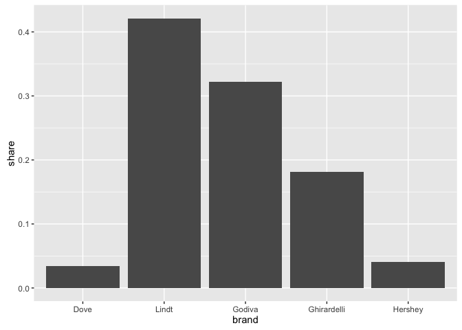
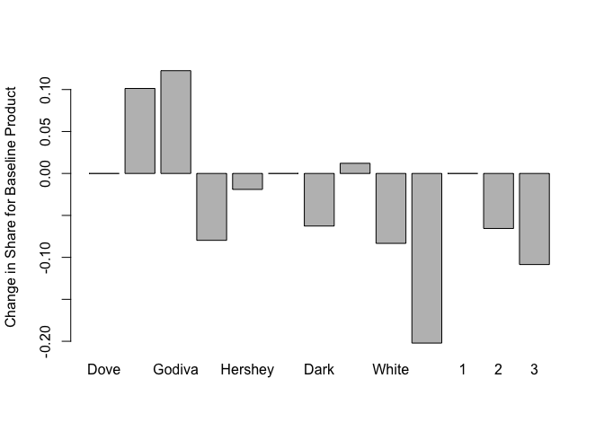

# Chocolate Preference Conjoint Analysis

Data collected as part of "Decisions about chocolate are
processed differently than decisions on gambles: Evidence from eye-tracking" by Betty E. Kim-Viechnicki.

* Kim-Viechnicki, B.E., Burla, Y., Feit, E., Plassmann, H.,& Kable, J.W. (2013, September). Decisions about chocolate are
processed differently than decisions on gambles: Evidence from eye-tracking. Poster session at the annual meeting of the
Society of Neuroeconomics, Lausanne, Switzerland.

### Contents
 * [Exploring the data](https://github.com/pawelmb57/Conjoint_Eyetracking_Analysis/blob/master/chocolate_eyetracking_exploring.md)
 * [Multinomial Logistic Model](https://github.com/pawelmb57/Conjoint_Eyetracking_Analysis/blob/master/Chocolate_Eye_Tracking_Analysis.md)
 * [RShiny Visual Tool](https://pawelb.shinyapps.io/chocolate_slider/)


# Summary

A conjoint analysis was conducted to help understand how consumers make choices regarding chocolate purchases.  Participants to a survey responded to questions such as the following:


Each trial had three alternatives to choose from consisting of a brand and type of a chocolate and the corresponding price.  In addition to the type of chocolate, the number of times each respondent fixated over one of the attributes was recorded.  Using this data we are able to answer the question of what attributes of chocolate to consumers consider most important in their purchsing decision.

## Key Takeaways

  * Godiva has the strongest brand closely followed by Lindt
  * Chocolate with dark nuts would gain approximately 30% of the market share
  * Consumrs generally like chocolate unter $3 and especially under $2
  * Most decisions are made after 5 fixations.
    + Respondents looked at price less than brand or type


#### Chocolate chosen by brand


<div>
    <a href="https://plot.ly/~PawelMichal/112/" target="_blank" title="Chosen by Brand" style="display: block; text-align: center;"></a>
    <script data-plotly="PawelMichal:112"  src="https://plot.ly/embed.js" async></script>
</div>

#### Chocolates chosen by type

<div>
    <a href="https://plot.ly/~PawelMichal/114/" target="_blank" title="Chosen by Type" style="display: block; text-align: center;"></a>
    <script data-plotly="PawelMichal:114"  src="https://plot.ly/embed.js" async></script>
</div>
#### Chocolates that were chosen and not chosen by price

<div>
    <a href="https://plot.ly/~PawelMichal/118/" target="_blank" title="Chosen and Not Chosen Price Histograms" style="display: block; text-align: center;"></a>
    <script data-plotly="PawelMichal:118"  src="https://plot.ly/embed.js" async></script>
</div>

#### Fixations by attribute


<div>
    <a href="https://plot.ly/~PawelMichal/120/" target="_blank" title="Chosen by Price_Fix" style="display: block; text-align: center;"></a>
    <script data-plotly="PawelMichal:120"  src="https://plot.ly/embed.js" async></script>
</div>


## Multinomial Logistic Model

### mlogit()

Using the mlogit() function in R, we were able to implement a multinomial logistic model with our dataset.  This model differs from a general logistic model in that it considers the choices of a respondent in each trial.  


```r
m.atr.int <- mlogit(Chosen ~ 0 + Price + brand + type , data=data.mlogit)
summary(m.atr.int)
```

```
## 
## Call:
## mlogit(formula = Chosen ~ 0 + Price + brand + type, data = data.mlogit, 
##     method = "nr", print.level = 0)
## 
## Frequencies of alternatives:
## pos 1 pos 2 pos 3 
## 0.374 0.326 0.300 
## 
## nr method
## 5 iterations, 0h:0m:0s 
## g'(-H)^-1g = 6.86E-06 
## successive function values within tolerance limits 
## 
## Coefficients :
##                  Estimate Std. Error t-value Pr(>|t|)    
## Price             -0.3093     0.0714   -4.33  1.5e-05 ***
## brandGhirardelli   0.4834     0.2201    2.20   0.0281 *  
## brandGodiva        0.5350     0.2056    2.60   0.0093 ** 
## brandHershey      -0.4530     0.2333   -1.94   0.0522 .  
## brandLindt        -0.1508     0.2259   -0.67   0.5046    
## typeDarkNuts      -0.3178     0.2082   -1.53   0.1269    
## typeMilk           0.0963     0.2152    0.45   0.6544    
## typeMilkNuts      -0.5018     0.2195   -2.29   0.0222 *  
## typeWhite         -1.7114     0.2612   -6.55  5.6e-11 ***
## ---
## Signif. codes:  0 '***' 0.001 '**' 0.01 '*' 0.05 '.' 0.1 ' ' 1
## 
## Log-Likelihood: -327
```


The results of the mlogit show the part worth estimates.  The estimate is listed for each level along with the standard error.  In this model, price is a continuous variable and the intercepts are not included. The estimates are interpreted relative to the base levels.  For instance, our data suggests that Godiva is a significant predictor of whether a chocolate will be chosen, and all else remaining equal will be chosen more often than Dove. Likewise, white chocolate is also a significant predictor and all else remaining equal will be chosen less often than dark chocolate.


### Choice Shares

Choice shares allow us to compare alternatives and predict the anticipated market share each alternative will obtian. For example, if we decide our product to be Hershey's Milk Chocolate priced at $2.00, and our competitors will carry their respective products, what will our market share be.  

Using the following alternatives the choice shares are calculated.


```r
m.atr <- mlogit(Chosen ~ 0 + Price + brand + type , data=data.mlogit)


new.data <- expand.grid(atr)[c(400,633,764,346,502),]
expand.grid(atr)[c(400,633,764,346,502),]
```

```
##           brand     type Price
## 400     Hershey     Milk   2.0
## 633      Godiva     Dark   3.0
## 764 Ghirardelli DarkNuts   3.5
## 346        Dove     Milk   1.8
## 502       Lindt MilkNuts   2.5
```

```r
p.mnl <- predict.mnl(m.atr,new.data)
ggplot(p.mnl , aes(x=brand , y=share)) +
          geom_bar(stat = "identity")
```

 

In this example, given the 5 choices listed above, Lindt is expected to gain the most market share of 42% and Dove the least with 3% of market share.


### Attribute Sensitivity

Sensitivity analysis allows us to estimate how market share would change if changes were make to the product, given our data and competitors.  For example, if we wanted to explore making dark chocolate for the first time, what could we expect as an increase to market share. 

For each level used in the experiment, this graphic shows how the base line product:

```r
expand.grid(atr)[c(1),]
```

```
##   brand     type Price
## 1  Dove MilkNuts   0.5
```
would change given what the competitors are doing:

```r
expand.grid(atr)[c(58,64,21,27,10),]
```

```
##          brand     type Price
## 58      Godiva     Dark   0.7
## 64 Ghirardelli DarkNuts   0.7
## 21        Dove     Milk   0.5
## 27       Lindt MilkNuts   0.6
## 10     Hershey     Dark   0.5
```


 


